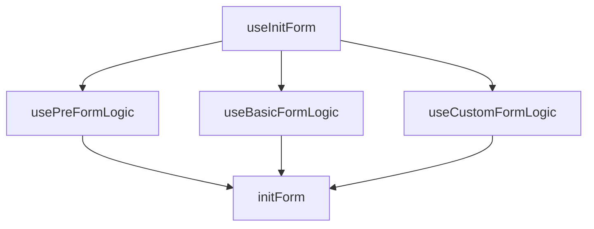

# 可组合的函数
组合关系

```mermaid {theme:'dark'}
graph TD;
  useInitForm-->usePreFormLogic-->initForm;
  useInitForm-->useBasicFormLogic-->initForm;
  useInitForm-->useCustomFormLogic-->initForm;
```

- 逻辑关注点分散在不同的use函数，同一个逻辑关注点相关的代码被归为了一组，无需再为了一个逻辑关注点在不同的选项块间来回滚动切换

- 可以很轻松地将不同关注点的代码收敛到一个外部文件中，不再需要为了抽象而重新组织代码，大大降低了重构成本，这在长期维护的大型项目中非常关键

---
src: ./reactive-1.md
---
