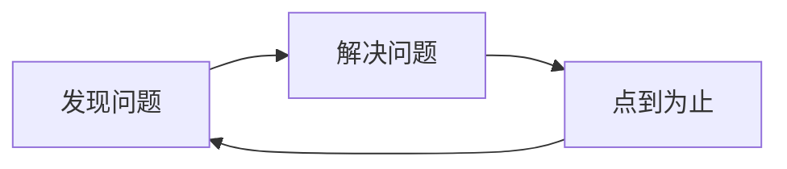

# Yak Shaving
剪牦牛毛

<v-click>

> `Yak Shaving`，是由麻省理工博士 `卡林·維埃里` 最早在90年代提出的一个编程术语。 指的是：要做一件事A，就得先做B，要做B就得先做C，要做C得先做D。 引申出来的意思就是“把简单的事情复杂化，忙了一圈，发现做了一堆与一开始要做的A毫不相干的事”

</v-click>

 

<v-clicks>

- 工作中，我们会遇到特别多的 `Yak Shaving` 事件，同时也意味着你发现了问题。我们应该让结果往好的方向发展、让问题变成一个好的驱动力
- 解决问题会有许多方法，最好的的就是利用现有的解决方案。或者你有更好的想法，那就利用好这个 `Yak`
- 要利用好 `Yak`，最重要的就是「点到为止」。奇思妙想够用即可，不应该在想法上花费过多的时间，及时回到问题的本身。

</v-clicks>

 

<v-click>

</v-click>

---
src: ./review.md
---
