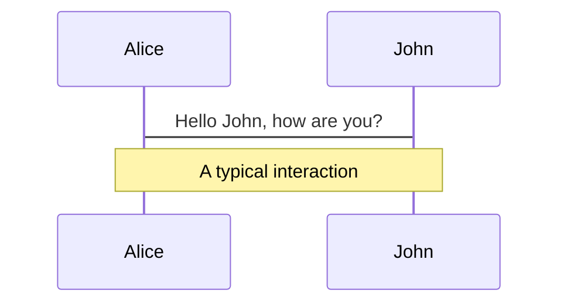
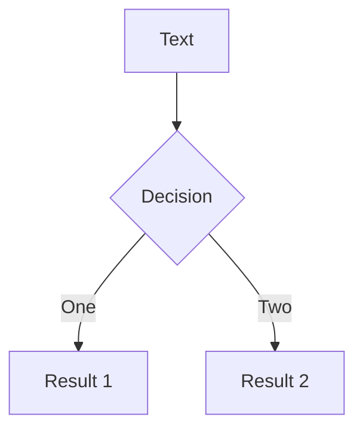
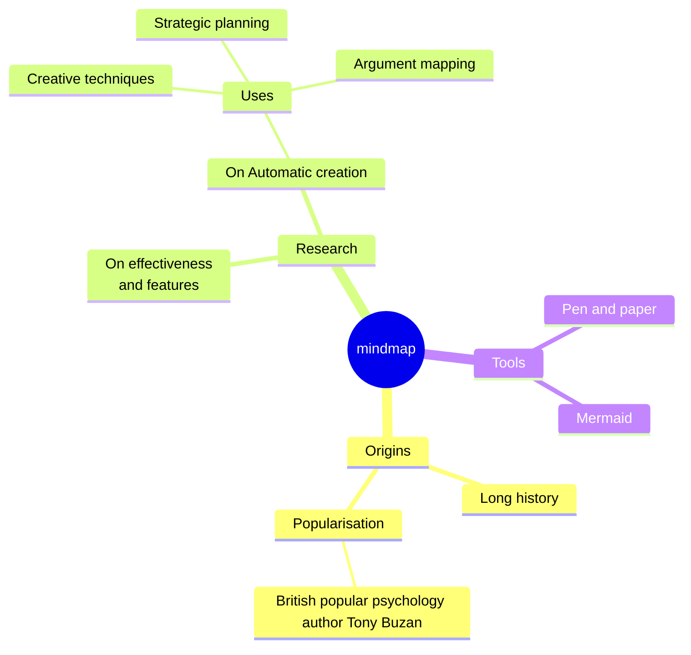
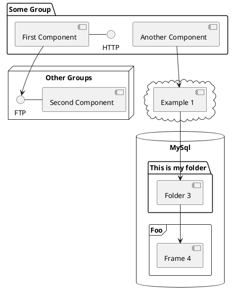

---
# 主题 id 或 主题包名称
theme: penguin
# 定义应用于幻灯片的布局组件
layout: intro
themeConfig:
  logoHeader: '/images/logo.svg'
# 幻灯片的总标题，如果没有指定，那么将以第一张拥有标题的幻灯片的标题作为总标题。
title: Slidev - 为开发者打造的演示文稿工具
author: 杨全云
# 幻灯片的配色方案，可以使用 'auto'，'light' 或者 'dark'
colorSchema: light
# 启用演讲者模式，可以是一个 boolean 值、'dev' 或 'build'
presenter: true
# 绘图与批注 https://cn.sli.dev/features/drawing
drawings:
  persist: true # 对绘图进行持久化，把绘图最为SVG保存在.slidev/drawings目录下
  presenterOnly: false # 禁用绘图，仅在演讲者模式可用
# 幻灯片过渡效果 https://cn.sli.dev/guide/animations#slide-transitions
transition: slide-left
---

# Slidev - 为开发者打造的演示文稿工具

<div class="py-1">
  政务交付及研发部 - 杨全云
</div>

<!--
备注：每张幻灯片的最后一个注释块将被视为幻灯片备注。在演讲者模式下能正常查看，观看者视角则看不到。

提到幻灯片制作工具，大家都会想到PowerPoint或Keynote，它们在制作带有复杂动画和图表等方面效果相当好。但是我们在做PPT的时候，是不是感到自己在与无聊的模版和繁琐的排版斗争，而不是关注于内容本身？今天为大家介绍一款专为开发者设计的演示文稿工具——Slidev，让你能够像写代码一样写幻灯片。
-->

---
transition: fade-out
---

# 什么是Slidev?

**Slidev**（slidev + dev，发音为"/slaɪdɪv/"）是一个基于web技术的幻灯片制作和演示工具，专为开发者设计。它的核心理念是让开发者能够专注于使用Markdown编写内容，同时利用Vue和Web技术的强大能力，创建出像素级完美的设计和交互式演示。

<br>
Slidev是开源的，拥有强大的社区支持，它采用渐进式设计，可以从一个简单的Markdown文件开始，随着需求的增加逐步添加功能，而无需复杂的配置。
<br>
<br>

- 📝 **基于Markdown** - 使用Markdown格式来编写幻灯片，让用户能够专注于内容创作，同时支持使用Git进行版本控制
- 🧑‍💻 **开发者友好** - 为开发者提供一流的代码片段支持，使用Shiki实现精确的语法高亮，并支持Shiki Magic Move和TwoSlash集成，使Slidev成为技术演讲的最佳选择
- 🎨 **主题丰富** - 主题可以通过 npm 包来安装。只需一行代码就可以将主题应用在您的幻灯片中，满足不同场景的视觉需求
- 🤹 **可交互** - 可以在幻灯片中编写 Vue 组件，并在演示过程中与之交互，以更有趣、直观的方式表达您的想法
- 🎥 **录制功能** - 内置录制和摄像头视图
- 📤 **跨平台** - 支持导出为 PDF、PPTX和图片格式，甚至可以导出为可托管的单页应用程序
- 🛠 **可自定义** - 几乎网页上能做到的，在 Slidev 中都能实现

<br>
<br>
<!--
你可以在 markdown 中使用 <style> 标签，仅为当前幻灯片定义样式。Learn more: https://cn.sli.dev/features/slide-scope-style
-->

<style>
h1 {
  background-color: #2B90B6;
  background-image: linear-gradient(45deg, #4EC5D4 10%, #146b8c 20%);
  background-size: 100%;
  -webkit-background-clip: text;
  -moz-background-clip: text;
  -webkit-text-fill-color: transparent;
  -moz-text-fill-color: transparent;
}
</style>

---
transition: slide-up
level: 2
---

# 创建幻灯片

#### 在浏览器中创建
通过StackBlitz在浏览器中创建幻灯片：[sli.dev/new](https://stackblitz.com/github/slidevjs/new?file=slides.md)

<br/>
<br/>

#### 在本地创建
前置条件：需要先安装**Node.js >= 18.0**

在终端运行以下命令来创建一个新的 Slidev 项目：
```bash
# npm
npm init slidev@latest

# pnpm
pnpm create slidev

# yarn
yarn create slidev
```

---
transition: slide-up
---

# 代码高亮

Use code snippets and get the highlighting directly, and even types hover!

```ts [filename-example.ts] {all|4|6|6-7|9|all} twoslash
// TwoSlash enables TypeScript hover information
// and errors in markdown code blocks
// More at https://shiki.style/packages/twoslash
import { computed, ref } from 'vue'

const count = ref(0)
const doubled = computed(() => count.value * 2)

doubled.value = 2
```

<arrow v-click="[4, 5]" x1="350" y1="310" x2="195" y2="342" color="#953" width="2" arrowSize="1" />

<!-- This allow you to embed external code blocks -->
<<< @/snippets/external.ts#snippet

<!-- Footer -->

[Learn more](https://sli.dev/features/line-highlighting)

<!-- Inline style -->
<style>
.footnotes-sep {
  @apply mt-5 opacity-10;
}
.footnotes {
  @apply text-sm opacity-75;
}
.footnote-backref {
  display: none;
}
</style>

<!--
Notes can also sync with clicks

[click] This will be highlighted after the first click

[click] Highlighted with `count = ref(0)`

[click:3] Last click (skip two clicks)
-->

---
layout: image-right
image: https://cover.sli.dev
---


---
level: 2
---

# Shiki Magic Move

Powered by [shiki-magic-move](https://shiki-magic-move.netlify.app/), Slidev supports animations across multiple code snippets.

Add multiple code blocks and wrap them with <code>````md magic-move</code> (four backticks) to enable the magic move. For example:

````md magic-move {lines: true}
```ts {*|2|*}
// step 1
const author = reactive({
  name: 'John Doe',
  books: [
    'Vue 2 - Advanced Guide',
    'Vue 3 - Basic Guide',
    'Vue 4 - The Mystery'
  ]
})
```

```ts {*|1-2|3-4|3-4,8}
// step 2
export default {
  data() {
    return {
      author: {
        name: 'John Doe',
        books: [
          'Vue 2 - Advanced Guide',
          'Vue 3 - Basic Guide',
          'Vue 4 - The Mystery'
        ]
      }
    }
  }
}
```

```ts
// step 3
export default {
  data: () => ({
    author: {
      name: 'John Doe',
      books: [
        'Vue 2 - Advanced Guide',
        'Vue 3 - Basic Guide',
        'Vue 4 - The Mystery'
      ]
    }
  })
}
```

Non-code blocks are ignored.

```vue
<!-- step 4 -->
<script setup>
const author = {
  name: 'John Doe',
  books: [
    'Vue 2 - Advanced Guide',
    'Vue 3 - Basic Guide',
    'Vue 4 - The Mystery'
  ]
}
</script>
```
````

---

# Components

<div grid="~ cols-2 gap-4">
<div>

You can use Vue components directly inside your slides.

We have provided a few built-in components like `<Tweet/>` and `<Youtube/>` that you can use directly. And adding your custom components is also super easy.

```html
<Counter :count="10" />
```

<!-- ./components/Counter.vue -->
<Counter :count="10" m="t-4" />

Check out [the guides](https://sli.dev/builtin/components.html) for more.

</div>
<div>

```html
<Tweet id="1390115482657726468" />
```

<Tweet id="1390115482657726468" scale="0.65" />

</div>
</div>

<!--
Presenter note with **bold**, *italic*, and ~~striked~~ text.

Also, HTML elements are valid:
<div class="flex w-full">
  <span style="flex-grow: 1;">Left content</span>
  <span>Right content</span>
</div>
-->

---
class: px-20
---

# Themes

Slidev comes with powerful theming support. Themes can provide styles, layouts, components, or even configurations for tools. Switching between themes by just **one edit** in your frontmatter:

<div grid="~ cols-2 gap-2" m="t-2">

```yaml
---
theme: default
---
```

```yaml
---
theme: seriph
---
```


</div>

Read more about [How to use a theme](https://sli.dev/guide/theme-addon#use-theme) and
check out the [Awesome Themes Gallery](https://sli.dev/resources/theme-gallery).

---

# Clicks Animations

You can add `v-click` to elements to add a click animation.

<div v-click>

This shows up when you click the slide:

```html
<div v-click>This shows up when you click the slide.</div>
```

</div>

<br>

<v-click>

The <span v-mark.red="3"><code>v-mark</code> directive</span>
also allows you to add
<span v-mark.circle.orange="4">inline marks</span>
, powered by [Rough Notation](https://roughnotation.com/):

```html
<span v-mark.underline.orange>inline markers</span>
```

</v-click>

<div mt-20 v-click>

[Learn more](https://sli.dev/guide/animations#click-animation)

</div>

---

# Motions

Motion animations are powered by [@vueuse/motion](https://motion.vueuse.org/), triggered by `v-motion` directive.

```html
<div
  v-motion
  :initial="{ x: -80 }"
  :enter="{ x: 0 }"
  :click-3="{ x: 80 }"
  :leave="{ x: 1000 }"
>
  Slidev
</div>
```

<div class="w-60 relative">
  <div class="relative w-40 h-40">
    
    
    
  </div>

  <div
    class="text-5xl absolute top-14 left-40 text-[#2B90B6] -z-1"
    v-motion
    :initial="{ x: -80, opacity: 0}"
    :enter="{ x: 0, opacity: 1, transition: { delay: 2000, duration: 1000 } }">
    Slidev
  </div>
</div>

<!-- vue script setup scripts can be directly used in markdown, and will only affects current page -->
<script setup lang="ts">
const final = {
  x: 0,
  y: 0,
  rotate: 0,
  scale: 1,
  transition: {
    type: 'spring',
    damping: 10,
    stiffness: 20,
    mass: 2
  }
}
</script>

<div
  v-motion
  :initial="{ x:35, y: 30, opacity: 0}"
  :enter="{ y: 0, opacity: 1, transition: { delay: 3500 } }">

[Learn more](https://sli.dev/guide/animations.html#motion)

</div>

---

# LaTeX

LaTeX is supported out-of-box. Powered by [KaTeX](https://katex.org/).

<div h-3 />

Inline $\sqrt{3x-1}+(1+x)^2$

Block
$$ {1|3|all}
\begin{aligned}
\nabla \cdot \vec{E} &= \frac{\rho}{\varepsilon_0} \\
\nabla \cdot \vec{B} &= 0 \\
\nabla \times \vec{E} &= -\frac{\partial\vec{B}}{\partial t} \\
\nabla \times \vec{B} &= \mu_0\vec{J} + \mu_0\varepsilon_0\frac{\partial\vec{E}}{\partial t}
\end{aligned}
$$

[Learn more](https://sli.dev/features/latex)

---

# Diagrams

You can create diagrams / graphs from textual descriptions, directly in your Markdown.

<div class="grid grid-cols-4 gap-5 pt-4 -mb-6">









</div>

Learn more: [Mermaid Diagrams](https://sli.dev/features/mermaid) and [PlantUML Diagrams](https://sli.dev/features/plantuml)

---
foo: bar
dragPos:
  square: 691,32,167,_,-16
---

# Draggable Elements

Double-click on the draggable elements to edit their positions.

<br>

###### Directive Usage

```md

```

<br>

###### Component Usage

```md
<v-drag text-3xl>
  <div class="i-carbon:arrow-up" />
  Use the `v-drag` component to have a draggable container!
</v-drag>
```

<v-drag pos="663,206,261,_,-15">
  <div text-center text-3xl border border-main rounded>
    Double-click me!
  </div>
</v-drag>


###### Draggable Arrow

```md
<v-drag-arrow two-way />
```

<v-drag-arrow pos="67,452,253,46" two-way op70 />

---
src: ./pages/imported-slides.md
hide: false
---

---

# Monaco Editor

Slidev provides built-in Monaco Editor support.

Add `{monaco}` to the code block to turn it into an editor:

```ts {monaco}
import { ref } from 'vue'
import { emptyArray } from './external'

const arr = ref(emptyArray(10))
```

Use `{monaco-run}` to create an editor that can execute the code directly in the slide:

```ts {monaco-run}
import { version } from 'vue'
import { emptyArray, sayHello } from './external'

sayHello()
console.log(`vue ${version}`)
console.log(emptyArray<number>(10).reduce(fib => [...fib, fib.at(-1)! + fib.at(-2)!], [1, 1]))
```

---
layout: center
class: text-center
---

# Learn More

[Documentation](https://sli.dev) · [GitHub](https://github.com/slidevjs/slidev) · [Showcases](https://sli.dev/resources/showcases)

<PoweredBySlidev mt-10 />
